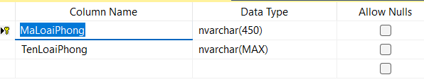
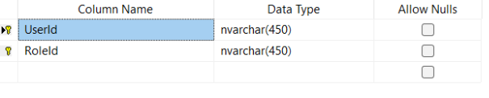
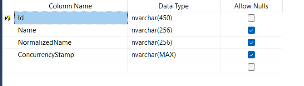
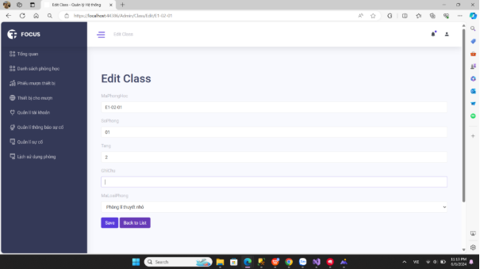

||
BỘ GIÁO DỤC VÀ ĐÀO TẠO

**TRƯỜNG ĐẠI HỌC CÔNG NGHỆ TP. HCM**
|
| :-: | :-: |

**BÁO CÁO ĐỒ ÁN CƠ SỞ**

**PHẦN MỀM QUẢN LÝ PHÒNG HỌC**

Ngành:	**CÔNG NGHỆ THÔNG TIN**

Giảng viên hướng dẫn: **ThS. Võ Tấn Dũng**

Nhóm Sinh viên thực hiện:

Tên	Lớp	MSSV

`	`Võ Minh Hiếu	21DTHE3	2180607509

TP. Hồ Chí Minh, 2024

# **MỤC LỤC**

[**MỤC LỤC**	iii](#_toc14179)

[**DANH MỤC HÌNH ẢNH**	v](#_toc9505)

[**LỜI MỞ ĐẦU**	1](#_toc29369)

[1. Lý do chọn đề tài	1](#_toc23530)

[2. Mục đích nghiên cứu	1](#_toc10016)

[3. Ý nghĩa của việc nghiên cứu	2](#_toc31505)

[4. Kết cấu đề tài:	2](#_toc16564)

[**CHƯƠNG 1: TỔNG QUAN VÀ CƠ SỞ LÝ THUYẾT**	3](#_toc17619)

[1.1 Khảo sát hiện trạng	3](#_toc11531)

[1.2 Nhiệm vụ của việc nghiên cứu	3](#_toc31637)

[1.3 Đối tượng và khách thể nghiên cứu	3](#_toc2960)

[1.4 Phương pháp và phạm vi nghiên cứu	3](#_toc30023)

[*1.4.1* Phương pháp nghiên cứu	3](#_toc1500)

[*1.4.2* Phạm vi nghiên cứu	4](#_toc23259)

[1.5 Giới thiệu ngôn ngữ, framework, thư viện, nền tảng	4](#_toc14292)

[*1.5.1* Khái niệm ngôn ngữ lập trình	4](#_toc31867)

[*1.5.2* Tìm hiểu về ASP.NET Core	4](#_toc3459)

[*1.5.3* Tìm hiểu SQL Server	5](#_toc10337)

[**CHƯƠNG 2: PHÂN TÍCH VÀ THIẾT KẾ**	6](#_toc27925)

[2.1 Quan hệ giữa các bảng	6](#_toc8575)

[2.2 Thiết kế các bảng	7](#_toc30046)

[*2.2.1* Bảng lưu thông tin tài khoản (AspNetUsers)	7](#_toc31834)

[*2.2.2* Bảng lưu thông tin danh sách các phòng học (Classes)	7](#_toc7107)

[*2.2.3* Bảng lưu thông tin loại phòng (RoomCategory)	8](#_toc10927)

[*2.2.4* Bảng lưu thông tin phòng học (RoomSchecdules)	8](#_toc5203)

[*2.2.5* Bảng lưu thông tin phiếu mượn phòng (LoanEquipmentTickets)	8](#_toc16731)

[*2.2.6* Bảng lưu chi tiết thiết bị mượn (LoanEquipments)	9](#_toc13529)

[*2.2.7* Bảng lưu vai trò	9](#_toc333)

[*2.2.8* Bảng lưu thông tin từng vai trò	10](#_toc8982)

[*2.2.9* Bảng lưu thông tin quản lý yêu cầu hỗ trợ cá nhân	10](#_toc29819)

[*2.2.10* Bảng lưu vấn đề sự cố	10](#_toc14204)

[*2.2.11* Bảng lưu chi tiết sự cố	11](#_toc30362)

[2.3 Các mô hình dữ liệu	11](#_toc22479)

[*2.3.1* Mô hình UseCase tổng quát	11](#_toc29624)

[*2.3.2* Mô hình UseCase quản lý tài khoản	12](#_toc20434)

[*2.3.3* Mô hình UseCase quản lý yêu cầu hỗ trợ	13](#_toc8372)

[*2.3.4* Mô hình UseCase quản lý mượn thiết bị	14](#_toc24685)

[*2.3.5* Mô hình UseCase quản lý lịch sử dụng phòng	15](#_toc9296)

[2.4 Sơ đồ ClassDiagram	16](#_toc16622)

[2.5 Sơ đồ ERD	16](#_toc7664)

[2.6 Thiết kế giao diện website	16](#_toc27467)

[*2.6.1* Giao diện trang chủ	16](#_toc8007)

[*2.6.2* Giao diện trang đăng nhập	17](#_toc5017)

[*2.6.3* Giao diện trang đăng ký tài khoản	17](#_toc6276)

[*2.6.4* Giao diện trang danh sách các phòng	17](#_toc27664)

[*2.6.5* Giao diện trang sửa thông tin phòng học	18](#_toc29366)

[*2.6.6* Giao diện trang phiếu mượn thiết bị	18](#_toc8786)

[*2.6.7* Giao diện trang chi tiết phiếu mượn	19](#_toc12931)

[*2.6.8* Giao diện trang chỉnh sửa phiếu mượn	19](#_toc10196)

[*2.6.9* Giao diện trang quản lý danh sách thiết bị mượn	20](#_toc3430)

[*2.6.10* Giao diện trang chỉnh sửa danh sách thiết bị mượn	20](#_toc9875)

[*2.6.11* Giao diện trang quản lý tài khoản	21](#_toc28175)

[*2.6.12* Giao diện trang chỉnh sửa tài khoản	21](#_toc19588)

[*2.6.13* Giao diện trang quản lý thông báo sự cố	22](#_toc2205)

[*2.6.14* Giao diện trang chỉnh sửa yêu cầu hỗ trợ	22](#_toc11094)

[*2.6.15* Giao diện trang quản lý sự cố	23](#_toc26058)

[*2.6.16* Giao diện trang chỉnh sửa chi tiết vấn đề	23](#_toc6023)

[*2.6.17* Giao diện trang lịch sử dụng phòng	24](#_toc17464)

[*2.6.18* Giao diện trang tạo lịch sử dụng phòng	24](#_toc2264)

[2.7 Mô tả chi tiết các chức năng cho từng vai trò (role) trong hệ thống:	25](#_toc27021)

[*2.7.1* Admin	25](#_toc20385)

[*2.7.2* Giáo viên(GV)	26](#_toc2298)

[*2.7.3* Kỹ thuật viên(KTV)	27](#_toc19869)

[*2.7.4* Quản lý (QL)	28](#_toc21341)

[**CHƯƠNG 3: KẾT LUẬN**	30](#_toc5656)

[3.1 Ưu điểm	30](#_toc9508)

[3.2 Nhược điểm	30](#_toc14516)

[3.3 Hướng phát triển toàn diện	30](#_toc10394)

# **DANH MỤC HÌNH ẢNH**
[Hình 1.1: Logo ngôn ngữ lập trình C#	4](#_toc21443)

[Hình 1.2: Logo ASP.NET Core	5](#_toc14430)

[Hình 1.3: Logo SQL Server	6](#_toc2587)

[Hình 2.1: Diagram trong SQL Mô hình quan niệm dữ liệu (thực thể - kết hợp)	7](#_toc17380)

[Hình 2.2 Bảng lưu thông tin tài khoản	7](#_toc16503)

[Hình 2.3 Bảng lưu thông tin các phòng học	8](#_toc26663)

[Hình 2.4 Bảng lưu thông tin loại phòng	8](#_toc1870)

[Hình 2.5 Bảng lưu thông tin phòng học	8](#_toc23528)

[Hình 2.6 Bảng lưu thông tin phiếu mượn phòng	9](#_toc10716)

[Hình 2.7 Bảng lưu chi tiết thiết bị mượn	9](#_toc30445)

[Hình 2.8 Bảng lưu vai trò	9](#_toc23649)

[Hình 2.9  Bảng lưu thông tin từng vai trò	10](#_toc12733)

[Hình 2.11  Bảng lưu vấn đề sự cố	10](#_toc7530)

[Hình 2.12  Bảng lưu chi tiết sự cố	11](#_toc24659)

[Hình 2.13 Mô hình UseCase tổng quát	11](#_toc27198)

[Hình 2.14 Mô hình UseCase quản lý tài khoản	12](#_toc26430)

[Hình 2.15 Mô hình UseCase quản lý yêu cầu hỗ trợ	13](#_toc10217)

[Hình 2.16 Mô hình UseCase quản lý mượn thiết bị	14](#_toc26388)

[Hình 2.17 Mô hình UseCase quản lý lịch sử dụng phòng	15](#_toc28034)

[Hình 2.18 Sơ đồ ClassDiagram	16](#_toc30748)

[Hình 2.19 Sơ đồ ERD	16](#_toc401)

[Hình 2.20 Giao diện trang chủ	16](#_toc8343)

[Hình 2.21 Giao diện trang đăng nhập	17](#_toc11208)

[Hình 2.22 Giao diện trang đăng ký tài khoản	17](#_toc16920)

[Hình 2.23 Giao diện trang danh sách các phòng	17](#_toc17775)

[Hình 2.24 Giao diện trang sửa thông tin phòng học	18](#_toc24260)

[Hình 2.25 Giao diện trang phiếu mượn thiết bị	18](#_toc1578)

[Hình 2.26 Giao diện trang chi tiết phiếu mượn	19](#_toc23926)

[Hình 2.27 Giao diện trang chỉnh sửa phiếu mượn	19](#_toc14346)

[Hình 2.28 Giao diện trang quản lý danh sách thiết bị mượn	20](#_toc27671)

[Hình 2.29 Giao diện trang chỉnh sửa thiết bị mượn	20](#_toc5381)

[Hình 2.30 Giao diện trang quản lý tài khoản	21](#_toc22958)

[Hình 2.31 Giao diện trang chỉnh sửa tài khoản	21](#_toc24903)

[Hình 2.32 Giao diện trang quản lý thông báo sự cố	22](#_toc19954)

[Hình 2.33  Giao diện trang chỉnh sửa yêu cầu hỗ trợ	22](#_toc12541)

[Hình 2.34  Giao diên trang quản lý sự cố	23](#_toc12900)

[Hình 2.35  Giao diện trang chỉnh sửa chi tiết vấn đề	23](#_toc32138)

[Hình 2.36  Giao diện trang lịch sử dụng phòng	24](#_toc312)

[Hình 2.37  Giao diện trang tạo lịch sử dụng phòng	24](#_toc3393)

#
v
# **LỜI MỞ ĐẦU**
1. **Lý do chọn đề tài**

Trong thế giới hiện đại đang tiến bước về hướng số hóa, việc quản lý phòng học trực tuyến trở thành một đề tài không chỉ quan trọng mà còn mang lại nhiều lợi ích đáng giá. Bằng cách áp dụng công nghệ vào việc quản lý các phòng học, ta có thể tạo ra một môi trường học tập hiệu quả và thuận tiện cho cả sinh viên và giảng viên. Dưới đây là một số lý do tại sao chúng ta nên chọn đề tài này để phát triển trang web quản lý phòng học.

Thứ nhất, tính ứng dụng cao của đề tài này không thể phủ nhận. Phòng học là trung tâm của quá trình học tập và giảng dạy. Việc quản lý chúng một cách thông minh và hiệu quả có thể giúp tối ưu hóa việc sử dụng không gian, tài nguyên, và thời gian học tập.

Thứ hai, thị trường đang đặt ra nhu cầu cao về các hệ thống quản lý phòng học thông minh. Trong bối cảnh mà việc học trực tuyến và học kỹ thuật số đang trở nên phổ biến hơn bao giờ hết, việc phát triển một trang web quản lý phòng học có thể mang lại nhiều cơ hội kinh doanh và phát triển nghề nghiệp.

Tiếp theo, tính tiện ích của trang web này không chỉ là một ưu điểm mà là một yếu tố cần thiết. Tính năng đặt chỗ, xem lịch trình, ghi nhận sự kiện và thông báo có thể giúp tối ưu hóa trải nghiệm học tập và giảng dạy.

Không chỉ làm việc từ một nơi cố định, tính linh hoạt của trang web quản lý phòng học còn là một điểm cộng lớn. Bằng cách truy cập từ bất kỳ thiết bị nào có kết nối internet, sinh viên và giảng viên có thể dễ dàng truy cập thông tin và tương tác với nhau mọi lúc, mọi nơi.

Ngoài ra, tính tương tác của trang web này cũng đáng chú ý. Việc chia sẻ tài liệu, ghi chú và thảo luận trực tuyến giữa sinh viên và giảng viên có thể tạo điều kiện cho một môi trường học tập đa chiều và phong phú.

Cuối cùng, việc xây dựng một trang web quản lý phòng học không chỉ là một thách thức về mặt kỹ thuật mà còn là cơ hội để học hỏi và phát triển kỹ năng mới trong lĩnh vực công nghệ thông tin.

Tóm lại, việc chọn đề tài "Quản lý phòng học" cho trang web có thể mang lại nhiều lợi ích to lớn cho cả người sử dụng và nhà phát triển. Sự kết hợp giữa công nghệ và giáo dục có thể tạo ra một môi trường học tập tiên tiến và phù hợp với nhu cầu của thế hệ trẻ hiện nay.

1. **Mục đích nghiên cứu**

Mục đích nghiên cứu về việc quản lý lớp học thông qua một trang web là để tạo ra một hệ thống hiệu quả và tiện lợi giúp quản lý các hoạt động giảng dạy và học tập trong môi trường học tập trực tuyến:

- **Tối ưu hóa quản lý lớp học**: Nghiên cứu nhằm vào việc phát triển các công cụ và tính năng trên trang web giúp giáo viên quản lý lớp học một cách hiệu quả hơn. Điều này bao gồm việc tổ chức lịch trình giảng dạy, giao bài tập, quản lý điểm số và phản hồi cho sinh viên.
- **Tăng cường tương tác giữa giáo viên và sinh viên:** Một mục đích quan trọng của việc nghiên cứu là xây dựng các tính năng để tạo điều kiện cho tương tác chặt chẽ giữa giáo viên và sinh viên. Điều này có thể bao gồm diễn đàn trực tuyến, hộp thư điện tử, trò chuyện trực tuyến và các công cụ phản hồi tức thì.
- **Tạo ra một môi trường học tập linh hoạt:** Mục đích của việc nghiên cứu là phát triển một trang web linh hoạt và dễ sử dụng, cho phép sinh viên tiếp cận tài liệu giảng dạy, nộp bài tập và thảo luận mọi lúc, mọi nơi thông qua các thiết bị di động hoặc máy tính cá nhân.
- **Nâng cao chất lượng giảng dạy và học tập:** Mục đích cuối cùng của việc nghiên cứu là tạo ra một môi trường học tập trực tuyến mang lại trải nghiệm giảng dạy và học tập tốt nhất cho cả giáo viên và sinh viên. Bằng cách cung cấp các công cụ và tài nguyên hỗ trợ, trang web có thể giúp cải thiện chất lượng giảng dạy và học tập, từ đó nâng cao hiệu suất và thành tích học tập của sinh viên.
1. **Ý nghĩa của việc nghiên cứu**

Kết quả của nghiên cứu mang ý nghĩa:

- Giúp tìm hiểu thêm về Net Core
- Giúp tìm hiểu về ngôn ngữ C#, CSS, HTML, JAVASCRIPT
- Giúp tìm hiểu sử dụng SQL Server
1. **Kết cấu đề tài:**
- LỜI MỞ ĐẦU
- CHƯƠNG 1: TỔNG QUAN VÀ CƠ SỞ LÝ THUYẾT
- CHƯƠNG 2: PHÂN TÍCH VÀ THIẾT KẾ
- CHƯƠNG 3: KẾT LUẬN

1. # **CHƯƠNG 1: TỔNG QUAN VÀ CƠ SỞ LÝ THUYẾT**
   1. ## **Khảo sát hiện trạng**
Hiện nay, nhiều trường học và cơ sở giáo dục vẫn đang sử dụng các phương pháp thủ công hoặc các phần mềm quản lý rời rạc, không đồng bộ để quản lý phòng kỹ thuật. Điều này dẫn đến nhiều hạn chế như:

- Khó khăn trong việc theo dõi và quản lý lịch sử sử dụng phòng.
- Dễ xảy ra sai sót trong quá trình quản lí cơ sở vật chất.
- Khó khăn trong việc xử lý các yêu cầu hỗ trợ kỹ thuật từ giảng viên và sinh viên.
- Thiếu sự liên kết và đồng bộ giữa các bộ phận quản lý.

1. ## **Nhiệm vụ của việc nghiên cứu**
Phần mền này được tạo ra với hy vọng là tạo ra một môi trường học tập trực tuyến hiệu quả, linh hoạt và tương tác, giúp nâng cao chất lượng giảng dạy và học tập trong môi trường giáo dục hiện đại.
1. ## **Đối tượng và khách thể nghiên cứu**
- Đối tượng nghiên cứu: Phần mềm quản lý phòng học
- Khách thể nghiên cứu:
- **Admin (Quản trị viên):** Người quản lý toàn bộ hệ thống, có quyền quản lý người dùng và các thông tin về cơ sở vật chất.
- **Giảng Viên (GV):** Người giảng dạy, sử dụng phòng học và thiết bị trong phòng để thực hiện các hoạt động giảng dạy và thực hành.
- **Kỹ Thuật Viên (KTV):** Người chịu trách nhiệm quản lý và bảo trì thiết bị trong phòng kỹ thuật, hỗ trợ giảng viên trong việc xử lý các yêu cầu kỹ thuật.
- **Quản Lý (QL):** Người quản lý các hoạt động phòng kỹ thuật, đảm bảo phòng luôn sẵn sàng và đáp ứng được yêu cầu của giảng viên và sinh viên.

1. ## **Phương pháp và phạm vi nghiên cứu**
   1. ### ***Phương pháp nghiên cứu***
- Tham khảo, nghiên cứu thêm các tài liệu trên trang web, youtube, tìm hiểu tình hình thực trạng của đề tài
- Tìm xem các đồ án khoá luận của các anh, chị khoá trước đã làm
  1. ### ***Phạm vi nghiên cứu***
Phạm vi xoay quanh các các phần mềm quản lý, đảm bảo đầy đủ các thành phần chính của phần mềm cũng như các chức năng cơ bản của phần mềm đó.
1. ## **Giới thiệu ngôn ngữ, framework, thư viện, nền tảng**
   1. ### ***Khái niệm ngôn ngữ lập trình*** 
**C#** (**C Sharp**, đọc là *"xi-sáp"*) là một [ngôn ngữ lập trình](https://vi.wikipedia.org/wiki/Ng%C3%B4n_ng%E1%BB%AF_l%E1%BA%ADp_tr%C3%ACnh "Ngôn ngữ lập trình") [hướng đối tượng](https://vi.wikipedia.org/wiki/L%E1%BA%ADp_tr%C3%ACnh_h%C6%B0%E1%BB%9Bng_%C4%91%E1%BB%91i_t%C6%B0%E1%BB%A3ng "Lập trình hướng đối tượng") đa năng, mạnh mẽ được phát triển bởi [Microsoft](https://vi.wikipedia.org/wiki/Microsoft "Microsoft"), C# là phần khởi đầu cho kế hoạch [.NET](https://vi.wikipedia.org/wiki/.NET_Framework ".NET Framework") của họ. Tên của ngôn ngữ bao gồm ký tự thăng theo Microsoft nhưng theo [ECMA](https://vi.wikipedia.org/w/index.php?title=ECMA&action=edit&redlink=1 "ECMA (trang không tồn tại)") là **C#**, chỉ bao gồm dấu số thường. Microsoft phát triển C# dựa trên [C++](https://vi.wikipedia.org/wiki/C++ "C++") và [Java]. C# được miêu tả là ngôn ngữ có được sự cân bằng giữa C++, [Visual Basic](https://vi.wikipedia.org/wiki/Visual_Basic "Visual Basic"), [Delphi](https://vi.wikipedia.org/wiki/Delphi_\(ng%C3%B4n_ng%E1%BB%AF_l%E1%BA%ADp_tr%C3%ACnh\) "Delphi (ngôn ngữ lập trình)") và [Java].

**Hình 1.1: Logo ngôn ngữ lập trình C#**

- **Những ưu điểm của C#**
- Đơn giản, hiện đại. Giao diện, cấu trúc của ngôn ngữ gần gũi và khá phổ biến, dễ dàng tiếp cận.
- Có thể biên dịch ở nhiều nền tảng khác nhau nhờ sự hỗ trợ của framework .NET
- C# cải tiến được nhiều khuyết điểm của 2 ngôn ngữ mà nó phát triển là C++ va Java.
- C# được thừa hưởng những thế mạnh của C++ và Java, Pascal.

1. ### ***Tìm hiểu về ASP.NET Core***
ASP.NET Core là một open-source mới và framework đa nền tảng (cross-platform) cho việc xây dựng những ứng dụng hiện tại dựa trên kết nối đám mây, giống như web apps, IoT và backend cho mobile. Ứng dụng ASP.NET Core có thể chạy trên .NET Core hoặc trên phiên bản đầy đủ của [.NET Framework](https://dotnet.microsoft.com/en-us/download/dotnet-framework). Nó được thiết kế để cung cấp và tối ưu development framework cho những dụng cái mà được triển khai trên đám mây (clound) hoặc chạy on-promise.

ASP.NET Core bao gồm các thành phần theo hướng module nhằm tối thiểu tài nguyên và chi phí phát triển, như vậy bạn giữ lại được sự mềm giẻo trong việc xây dựng giải pháp của bạn. Bạn có thể phát triển và chạy những ứng dụng ASP.NET Core đa nền tảng trên Windows, Mac và Linux.

Đồng thời nó đã trở thành một mã nguồn mở. Đây là một thay đổi rất lớn và theo mình là quan trọng nhất của ASP.NET Core. Điều mà trước đây khó có một lập trình viên nào có thể nghĩ đến. Có lẽ đó cũng là một xu thế mà các ngôn ngữ lập trình hiện nay đang hướng tới.

**Hình 1.2: Logo ASP.NET Core**

- **Các thành phần ASP.NET Core** 
- Ngôn ngữ: ASP.NET sử dụng nhiều ngôn ngữ lập trình khác nhau như [VB.NET](https://www.tutorialspoint.com/vb.net/index.htm) và [C#](https://learn.microsoft.com/en-us/dotnet/csharp/tour-of-csharp/tutorials/).
- Thư viện: ASP.NET có bộ thư viện chuẩn bao gồm các giao diện, các lớp và kiểu giá trị.
- Thời gian chạy ngôn ngữ chung (CLR): CLR – Common Language Runtime được sử dụng để thực hiện các hoạt động mã. Các hoạt động này sẽ thực hiện xử lý các ngoại lệ và thu gom rác.
  1. ### ***Tìm hiểu SQL Server***
SQL server là một dạng hệ quản trị cơ sở dữ liệu quan hệ (Relational Database Management System - Viết tắt là RDBMS). Nó được phát triển bởi gã khổng lồ trong làng công nghệ Microsoft vào năm 1989 và vẫn được sử dụng rộng rãi đến ngày nay. 

Có thể khi thấy chữ server thì nhiều bạn sẽ có những hiểu nhầm ở đây. Chúng ta sẽ cùng làm rõ về khái niệm SQL server bằng cách xem qua những đặc tính dưới đây của nó nhé:

\+ Thứ nhất, server là một thiết bị phần cứng nhưng SQL server thì về bản chất nó là một sản phẩm phầ[n mềm](https://vi.wikipedia.org/wiki/Ph%E1%BA%A7n_m%E1%BB%81m). Nó được các kỹ sư của Microsoft xây dựng và phát triển tử cách đây gần 30 năm rồi. Vì là sản phẩm phần mềm nên nó được cài trên các thiết bị phần cứng như server.

\+ Thứ hai, nó có chức năng chính là lưu trữ và truy xuất dữ liệu theo yêu cầu của các ứng dụng phần mềm khác. Chúng ta sẽ lưu trữ dữ liệu vào đó và sử dụng các câu lệnh để tìm kiếm dữ liệu khi cần.

\+ Thứ ba, nó sử dụng câu lệnh SQL (Transact-SQL) để trao đổi dữ liệu giữa máy khách (máy Client) và máy cài SQL Server.

**Hình 1.3: Logo SQL Server**

1. # **CHƯƠNG 2: PHÂN TÍCH VÀ THIẾT KẾ**
   1. ## **Quan hệ giữa các bảng**
![image_2024-06-03_174137251]

**Hình 2.1: Diagram trong SQL Mô hình quan niệm dữ liệu (thực thể - kết hợp)** 
1. ## **Thiết kế các bảng**
   1. ### ***Bảng lưu thông tin tài khoản (AspNetUsers)***
Sử dụng Id để làm khoá

  

**Hình 2.2 Bảng lưu thông tin tài khoản**
1. ### ***Bảng lưu thông tin danh sách các phòng học (Classes)***
Sử dụng MaPhongHoc làm khóa chính

**Hình 2.3 Bảng lưu thông tin các phòng học**
1. ### ***Bảng lưu thông tin loại phòng (RoomCategory)***
Sử dụng MaLoaiPhong làm khóa chính

**Hình 2.4 Bảng lưu thông tin loại phòng**
1. ### ***Bảng lưu thông tin phòng học (RoomSchecdules)***
Lưu thông tin phòng học nhằm dùng để phân loại các phòng với nhau

**Hình 2.5 Bảng lưu thông tin phòng học**
1. ### ***Bảng lưu thông tin phiếu mượn phòng (LoanEquipmentTickets)***
Lưu trữ thông tin phiếu mượn phòng gồm: tên người mượn, mã thiết bị mượn, số lượng mượn,..

 

**Hình 2.6 Bảng lưu thông tin phiếu mượn phòng**
1. ### ***Bảng lưu chi tiết thiết bị mượn (LoanEquipments)***
Ứng với mỗi phiếu mượn sẽ có một chi tiết thiết bị mượn để lưu trữ thông tin thiết bị và số lượng thiết bị đã mượn.

**Hình 2.7 Bảng lưu chi tiết thiết bị mượn**
1. ### ` `***Bảng lưu vai trò***

**Hình 2.8 Bảng lưu vai trò**
1. ### ` `***Bảng lưu thông tin từng vai trò***

**Hình 2.9  Bảng lưu thông tin từng vai trò**

1. ### ` `***Bảng lưu thông tin quản lý yêu cầu hỗ trợ cá nhân*** 

**Hình 2.10  Bảng lưu thông tin quản lý yêu cầu hỗ trợ cá nhân**
1. ### ` `***Bảng lưu vấn đề sự cố***

**Hình 2.11  Bảng lưu vấn đề sự cố**
1. ### ` `***Bảng lưu chi tiết sự cố***

**Hình 2.12  Bảng lưu chi tiết sự cố**

1. ## **Các mô hình dữ liệu**
   1. ### ***Mô hình UseCase tổng quát***

**Hình 2.13 Mô hình UseCase tổng quát**
1. ### ***Mô hình UseCase quản lý tài khoản***

**Hình 2.14 Mô hình UseCase quản lý tài khoản**
1. ### ***Mô hình UseCase quản lý yêu cầu hỗ trợ***

**Hình 2.15 Mô hình UseCase quản lý yêu cầu hỗ trợ**

1. ### ***Mô hình UseCase quản lý mượn thiết bị***

**Hình 2.16 Mô hình UseCase quản lý mượn thiết bị**

1. ### ***Mô hình UseCase quản lý lịch sử dụng phòng***

**Hình 2.17 Mô hình UseCase quản lý lịch sử dụng phòng**

1. ## **Sơ đồ ClassDiagram**
![image_2024-06-03_174137251]

**Hình 2.18 Sơ đồ ClassDiagram**
1. ## **Sơ đồ ERD**

**Hình 2.19 Sơ đồ ERD**
1. ## **Thiết kế giao diện website**
   1. ### ***Giao diện trang chủ***

**Hình 2.20 Giao diện trang chủ**
1. ### ***Giao diện trang đăng nhập***

**Hình 2.21 Giao diện trang đăng nhập**
1. ### ***Giao diện trang đăng ký tài khoản***

**Hình 2.22 Giao diện trang đăng ký tài khoản**
1. ### ***Giao diện trang danh sách các phòng***

**Hình 2.23 Giao diện trang danh sách các phòng**
1. ### ***Giao diện trang sửa thông tin phòng học***

**Hình 2.24 Giao diện trang sửa thông tin phòng học**
1. ### ***Giao diện trang phiếu mượn thiết bị*** 

**Hình 2.25 Giao diện trang phiếu mượn thiết bị**
1. ### ***Giao diện trang chi tiết phiếu mượn***

**Hình 2.26 Giao diện trang chi tiết phiếu mượn**
1. ### ***Giao diện trang chỉnh sửa phiếu mượn***

**Hình 2.27 Giao diện trang chỉnh sửa phiếu mượn**
1. ### ***Giao diện trang quản lý danh sách thiết bị mượn***

**Hình 2.28 Giao diện trang quản lý danh sách thiết bị mượn**
1. ### ***Giao diện trang chỉnh sửa danh sách thiết bị mượn***

**Hình 2.29 Giao diện trang chỉnh sửa thiết bị mượn**
1. ### ***Giao diện trang quản lý tài khoản***

**Hình 2.30 Giao diện trang quản lý tài khoản**
1. ### ***Giao diện trang chỉnh sửa tài khoản***

**Hình 2.31 Giao diện trang chỉnh sửa tài khoản**
1. ### ***Giao diện trang quản lý thông báo sự cố*** 

**Hình 2.32 Giao diện trang quản lý thông báo sự cố**
1. ### ***Giao diện trang chỉnh sửa yêu cầu hỗ trợ***

**Hình 2.33  Giao diện trang chỉnh sửa yêu cầu hỗ trợ**
1. ### ***Giao diện trang quản lý sự cố***

**Hình 2.34  Giao diên trang quản lý sự cố**

1. ### ` `***Giao diện trang chỉnh sửa chi tiết vấn đề***

**Hình 2.35  Giao diện trang chỉnh sửa chi tiết vấn đề**
1. ### ` `***Giao diện trang lịch sử dụng phòng***

**Hình 2.36  Giao diện trang lịch sử dụng phòng**
1. ### ` `***Giao diện trang tạo lịch sử dụng phòng***

**Hình 2.37  Giao diện trang tạo lịch sử dụng phòng**

<video width="320" height="240" controls>
  <source src="demo/448221248_7972127899516212_879103393974927019_n.mp4" type="video/mp4">
  Your browser does not support the video tag.
</video>

1. ## ` `**Mô tả chi tiết các chức năng cho từng vai trò (role) trong hệ thống:**
   1. ### ` `***Admin***
      1. #### ` `*Quản lý lớp học (ClassController)*
- **Tạo lớp học**: Admin có thể tạo một lớp học mới với các thông tin như mã phòng học, tên lớp, loại phòng, tầng...
- **Chỉnh sửa lớp học**: Admin có thể chỉnh sửa thông tin của một lớp học đã có.
- **Xóa lớp học**: Admin có thể xóa một lớp học khỏi hệ thống.
- **Xem danh sách lớp học**: Admin có thể xem danh sách tất cả các lớp học hiện có trong hệ thống.

1. #### ** *Quản lý loại phòng học (RoomCategoriesController)*
- **Tạo loại phòng học**: Admin có thể tạo mới một loại phòng học với thông tin như mã loại phòng, tên loại phòng...
- **Chỉnh sửa loại phòng học**: Admin có thể chỉnh sửa thông tin của một loại phòng học đã có.
- **Xóa loại phòng học**: Admin có thể xóa một loại phòng học khỏi hệ thống.
- **Xem danh sách loại phòng học**: Admin có thể xem danh sách tất cả các loại phòng học hiện có trong hệ thống.

1. #### ` `*Quản lý thiết bị mượn (LoanEquipmentController)*
- **Tạo thiết bị mượn**: Admin có thể tạo mới một thiết bị mượn với thông tin như mã thiết bị, tên thiết bị, số lượng...
- **Chỉnh sửa thiết bị mượn**: Admin có thể chỉnh sửa thông tin của một thiết bị mượn đã có.
- **Xóa thiết bị mượn**: Admin có thể xóa một thiết bị mượn khỏi hệ thống.

**Xem danh sách thiết bị mượn**: Admin có thể xem danh sách tất cả các thiết bị mượn hiện có trong hệ thống.

1. #### ** *Quản lý phiếu mượn thiết bị (LoanEquipmentTicketController)*
- **Tạo phiếu mượn thiết bị**: Admin có thể tạo mới một phiếu mượn thiết bị với các thông tin như tên người mượn, số điện thoại, mã thiết bị, số lượng mượn, ngày mượn, ngày trả, mã phòng học...
- **Chỉnh sửa phiếu mượn thiết bị**: Admin có thể chỉnh sửa thông tin của một phiếu mượn thiết bị đã có.
- **Xóa phiếu mượn thiết bị**: Admin có thể xóa một phiếu mượn thiết bị khỏi hệ thống.
- **Xem danh sách phiếu mượn thiết bị**: Admin có thể xem danh sách tất cả các phiếu mượn thiết bị hiện có trong hệ thống.

1. #### ` `*Quản lý lịch phòng (RoomScheduleController)*
- **Tạo lịch phòng**: Admin có thể tạo mới một lịch phòng với các thông tin như môn học, giảng viên, phòng học, ngày, thời gian bắt đầu, thời gian kết thúc...
- **Chỉnh sửa lịch phòng**: Admin có thể chỉnh sửa thông tin của một lịch phòng đã có.
- **Xóa lịch phòng**: Admin có thể xóa một lịch phòng khỏi hệ thống.
- **Xem danh sách lịch phòng**: Admin có thể xem danh sách tất cả các lịch phòng hiện có trong hệ thống.

1. #### ` `*Quản lý yêu cầu hỗ trợ((SupportRequestController)*
- **Tạo yêu cầu hỗ trợ**: Admin có thể tạo mới một yêu cầu hỗ trợ với các thông tin như mô tả, mã phòng học, mã loại vấn đề, mã chi tiết vấn đề, người dùng...
- **Chỉnh sửa yêu cầu hỗ trợ**: Admin có thể chỉnh sửa thông tin của một yêu cầu hỗ trợ đã có.
- **Xóa yêu cầu hỗ trợ**: Admin có thể xóa một yêu cầu hỗ trợ khỏi hệ thống.
- **Xem danh sách yêu cầu hỗ trợ**: Admin có thể xem danh sách tất cả các yêu cầu hỗ trợ hiện có trong hệ thống.

1. #### ` `*Quản lý người dùng (UsersController)*
- **Tạo người dùng**: Admin có thể tạo mới một người dùng với các thông tin như email, họ tên, số điện thoại, mã nhân viên, mật khẩu...
- **Chỉnh sửa người dùng**: Admin có thể chỉnh sửa thông tin của một người dùng đã có.
- **Xóa người dùng**: Admin có thể xóa một người dùng khỏi hệ thống.
- **Xem danh sách người dùng**: Admin có thể xem danh sách tất cả các người dùng hiện có trong hệ thống.
  1. ### ***Giáo viên(GV)***
     1. #### ` `*Quản lý yêu cầu hỗ trợ cá nhân (SupportRequestController)*
- **Tạo yêu cầu hỗ trợ**: Giáo viên có thể tạo mới một yêu cầu hỗ trợ với các thông tin như mô tả, mã phòng học, mã loại vấn đề, mã chi tiết vấn đề, người dùng...
- **Chỉnh sửa yêu cầu hỗ trợ**: Giáo viên có thể chỉnh sửa thông tin của một yêu cầu hỗ trợ đã có.
- **Xem danh sách yêu cầu hỗ trợ**: Giáo viên có thể xem danh sách tất cả các yêu cầu hỗ trợ của mình hiện có trong hệ thống.

####
1. ### ***Kỹ thuật viên(KTV)***
   1. #### ` `*Quản lý lớp học (ClassController)*
- **Xem danh sách lớp học**: Kỹ thuật viên có thể xem danh sách tất cả các lớp học hiện có trong hệ thống.

1. #### ** *Quản lý phiếu mượn thiết bị (LoanEquipmentTicketController)*
- **Tạo phiếu mượn thiết bị**: Kỹ thuật viên có thể tạo mới một phiếu mượn thiết bị với các thông tin như tên người mượn, số điện thoại, mã thiết bị, số lượng mượn, ngày mượn, ngày trả, mã phòng học...
- **Chỉnh sửa phiếu mượn thiết bị**: Kỹ thuật viên có thể chỉnh sửa thông tin của một phiếu mượn thiết bị đã có.
- **Xóa phiếu mượn thiết bị**: Kỹ thuật viên có thể xóa một phiếu mượn thiết bị khỏi hệ thống.
- **Xem danh sách phiếu mượn thiết bị**: Kỹ thuật viên có thể xem danh sách tất cả các phiếu mượn thiết bị hiện có trong hệ thống.

1. #### ` `*Quản lý lịch phòng (RoomScheduleController)*
- **Tạo lịch phòng**: Kỹ thuật viên có thể tạo mới một lịch phòng với các thông tin như môn học, giảng viên, phòng học, ngày, thời gian bắt đầu, thời gian kết thúc...
- **Chỉnh sửa lịch phòng**: Kỹ thuật viên có thể chỉnh sửa thông tin của một lịch phòng đã có.
- **Xóa lịch phòng**: Kỹ thuật viên có thể xóa một lịch phòng khỏi hệ thống.

**Xem danh sách lịch phòng**: Kỹ thuật viên có thể xem danh sách tất cả các lịch phòng hiện có trong hệ thống.
1. #### ** *Quản lý yêu cầu hỗ trợ (SupportRequestController)*
- **Tạo yêu cầu hỗ trợ**: Kỹ thuật viên có thể tạo mới một yêu cầu hỗ trợ với các thông tin như mô tả, mã phòng học, mã loại vấn đề, mã chi tiết vấn đề, người dùng...
- **Chỉnh sửa yêu cầu hỗ trợ**: Kỹ thuật viên có thể chỉnh sửa thông tin của một yêu cầu hỗ trợ đã có.
- **Xóa yêu cầu hỗ trợ**: Kỹ thuật viên có thể xóa một yêu cầu hỗ trợ khỏi hệ thống.
- **Xem danh sách yêu cầu hỗ trợ**: Kỹ thuật viên có thể xem danh sách tất cả các yêu cầu hỗ trợ hiện có trong hệ thống.

1. ### ***Quản lý (QL)***
   1. #### `  `*Quản lý lớp học (ClassController)*
- **Tạo lớp học**: Quản lý có thể tạo một lớp học mới với các thông tin như mã phòng học, tên lớp, loại phòng, tầng...
- **Chỉnh sửa lớp học**: Quản lý có thể chỉnh sửa thông tin của một lớp học đã có.
- **Xóa lớp học**: Quản lý có thể xóa một lớp học khỏi hệ thống.
- **Xem danh sách lớp học**: Quản lý có thể xem danh sách tất cả các lớp học hiện có trong hệ thống.

1. #### ` `*Quản lý thiết bị mượn (LoanEquipmentController)*
- **Tạo thiết bị mượn**: Quản lý có thể tạo mới một thiết bị mượn với thông tin như mã thiết bị, tên thiết bị, số lượng...
- **Chỉnh sửa thiết bị mượn**: Quản lý có thể chỉnh sửa thông tin của một thiết bị mượn đã có.
- **Xóa thiết bị mượn**: Quản lý có thể xóa một thiết bị mượn khỏi hệ thống.
- **Xem danh sách thiết bị mượn**: Quản lý có thể xem danh sách tất cả các thiết bị mượn hiện có trong hệ thống.

1. #### ` `*Quản lý phiếu mượn thiết bị (LoanEquipmentTicketController)*
- **Tạo phiếu mượn thiết bị**: Quản lý có thể tạo mới một phiếu mượn thiết bị với các thông tin như tên người mượn, số điện thoại, mã thiết bị, số lượng mượn, ngày mượn, ngày trả, mã phòng học...
- **Chỉnh sửa phiếu mượn thiết bị**: Quản lý có thể chỉnh sửa thông tin của một phiếu mượn thiết bị đã có.
- **Xóa phiếu mượn thiết bị**: Quản lý có thể xóa một phiếu mượn thiết bị khỏi hệ thống.
- **Xem danh sách phiếu mượn thiết bị**: Quản lý có thể xem danh sách tất cả các phiếu mượn thiết bị hiện có trong hệ thống.

1. #### ` `*Quản lý lịch phòng (RoomScheduleController)*
- **Tạo lịch phòng**: Quản lý có thể tạo mới một lịch phòng với các thông tin như môn học, giảng viên, phòng học, ngày, thời gian bắt đầu, thời gian kết thúc...
- **Chỉnh sửa lịch phòng**: Quản lý có thể chỉnh sửa thông tin của một lịch phòng đã có.
- **Xóa lịch phòng**: Quản lý có thể xóa một lịch phòng khỏi hệ thống.
- **Xem danh sách lịch phòng**: Quản lý có thể xem danh sách tất cả các lịch phòng hiện có trong hệ thống.

1. #### ` `*Quản lý yêu cầu hỗ trợ (SupportRequestController)*
- **Tạo yêu cầu hỗ trợ**: Quản lý có thể tạo mới một yêu cầu hỗ trợ với các thông tin như mô tả, mã phòng học, mã loại vấn đề, mã chi tiết vấn đề, người dùng...
- **Chỉnh sửa yêu cầu hỗ trợ**: Quản lý có thể chỉnh sửa thông tin của một yêu cầu hỗ trợ đã có.
- **Xóa yêu cầu hỗ trợ**: Quản lý có thể xóa một yêu cầu hỗ trợ khỏi hệ thống.
- **Xem danh sách yêu cầu hỗ trợ**: Quản lý có thể xem danh sách tất cả các yêu cầu hỗ trợ hiện có trong hệ thống.

1. #### ` `*Quản lý người dùng (UsersController)*
- **Tạo người dùng**: Quản lý có thể tạo mới một người dùng với các thông tin như email, họ tên, số điện thoại, mã nhân viên, mật khẩu...
- **Chỉnh sửa người dùng**: Quản lý có thể chỉnh sửa thông tin của một người dùng đã có.
- **Xóa người dùng**: Quản lý có thể xóa một người dùng khỏi hệ thống.
- **Xem danh sách người dùng**: Quản lý có thể xem danh sách tất cả các người dùng hiện có 
- trong hệ thống.

1. # **CHƯƠNG 3: KẾT LUẬN**
   1. ## **Ưu điểm**
- Giao diện thân thiện gần gũi với người dùng nhằm tăng hiệu suất học tập và công việc .
- Dữ liệu đưa vào được kiểm tra và chuẩn hóa đảm bảo sự đúng đắn và chặt chẽ
- Cung cấp đầy đủ, chính xác các thông tin về phòng học
- Hệ thống tin cậy và chính xác, giao diện thân thiện để sử dụng hệ thống linh động dữ liệu truy cập nhanh.
- Hệ thống đảm bảo bảo mật cho người sử dụng, đảm bảo người dùng thực hiện đúng phạm vi chức năng
  1. ## **Nhược điểm**
Website còn rất nhiều hạn chế. Vẫn còn thiếu các chức năng.

Trong quá trình xây dựng và hoàn thiện website chúng em cảm thấy chương trình có nhiều thiếu sót như:

- Bảo mật thông tin còn kém
- Pháp thực hiện còn nhiều sai sót
  1. ## **Hướng phát triển toàn diện**
- Bổ sung thêm nhiều chức năng nữa cho website

14

[Java]: https://vi.wikipedia.org/wiki/Java_(ng%C3%B4n_ng%E1%BB%AF_l%E1%BA%ADp_tr%C3%ACnh) "Java (ngôn ngữ lập trình)"
[image_2024-06-03_174137251]: demo/Aspose.Words.31067aa1-18b8-45e4-a3fb-37c62ff48090.005.png
[image_2024-06-03_174137251]: demo/Aspose.Words.31067aa1-18b8-45e4-a3fb-37c62ff48090.022.png
